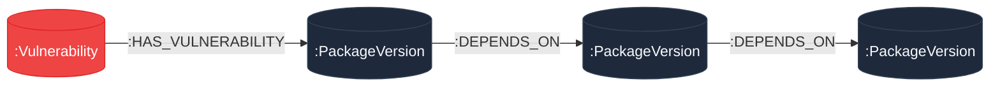

# Supply Chain Graph — Dependency Lineage & Vulnerability Impact Analyzer

> **Hosted Application Demo:** [https://supplychain-graph.netlify.app](https://www.google.com/search?q=https://supplychain-graph.netlify.app)
> **Backend API:** Built with Go 1.26 & Official Neo4j/Bolt Driver
> **Frontend App:** Built with SolidJS, TypeScript & Tailwind CSS
> **Database:** CognoDB Cloud (openCypher over Bolt protocol)

---

## 1. Project Overview & Use Case

**Supply Chain Graph** is a software supply chain security and lineage traversal engine. Modern enterprise software relies on deeply nested third-party dependencies. When a Common Vulnerabilities and Exposures (CVE) advisory is reported against a low-level library, security teams struggle to answer two fundamental questions:

1. **Blast Radius Analysis:** Which top-level applications transitively inherit this vulnerability?
2. **Dependency Traversal Trajectory:** Through which exact sub-assembly chain of package dependencies (1 to 5+ hops deep) is the security flaw propagated?

This application allows engineers to dynamically report new CVE advisories and instantly traverse multi-hop dependency paths to inspect affected software assets across the software supply chain.

---

## 2. Why a Graph Database?

Relational databases (RDBMS) struggle with transitive dependency graphs because dependency depth is variable and unpredictable.

### The Relational (SQL) Bottleneck

To answer a multi-hop impact query in SQL, developers must rely on complex, resource-heavy recursive Common Table Expressions (`WITH RECURSIVE`) or multiple table `JOIN`s across `packages`, `versions`, `dependencies`, and `vulnerabilities` tables. As dependency trees grow 5 to 10 hops deep, SQL performance degrades exponentially due to recursive table scanning ($O(N^k)$ time complexity).

### The Graph Advantage (openCypher on CognoDB)

In CognoDB, packages and vulnerability advisories are stored as **Nodes**, while dependencies and affected targets are stored as **Typed Relationships** (`:DEPENDS_ON`, `:HAS_VULNERABILITY`). Traversing a multi-hop dependency chain uses **index-free adjacency**, meaning the query engine follows direct memory pointers between relationships.

* **Constant-Time Pointer Traversal:** Querying a 5-hop transitive vulnerability trajectory executes in milliseconds regardless of overall database size.


* **Intuitive openCypher Queries:** Multi-hop path matching (`-[:DEPENDS_ON*1..5]->`) expresses complex supply chain relationships in a single, readable line of code.


---

## 3. Data Model Schema

The graph schema models the relationships between software packages, specific semantic versions, and security vulnerabilities:



### Node Labels & Properties

* **`Vulnerability`**: Represents a CVE security advisory.


* `id` (String, e.g., `"CVE-2024-1001"`)


* `severity` (String, e.g., `"CRITICAL"`, `"HIGH"`, `"MEDIUM"`)


* `createdAt` (Timestamp)


* **`PackageVersion`**: Represents a specific release of a software package.


* `id` (String, e.g., `"core-utils@1.0.0"`, `"http-parser@2.1.0"`)


* `name` (String, e.g., `"core-utils"`)


* `version` (String, e.g., `"1.0.0"`)


### Typed Relationships

* **`(:PackageVersion)-[:DEPENDS_ON]->(:PackageVersion)`**: Represents a direct build or runtime dependency.


* **`(:PackageVersion)-[:HAS_VULNERABILITY]->(:Vulnerability)`**: Links a vulnerable package version to its corresponding CVE node.


---

## 4. Key openCypher Queries Explained

All queries interact with CognoDB via **parameterised variables** (`map[string]interface{}`) to strictly enforce query safety and prevent Cypher injection vulnerabilities.

### Query A: Multi-Hop Transitive Dependency Traversal (1 to 5 Hops)

This query performs variable-length path matching to calculate the full blast radius trajectory of a targeted CVE:

```cypher
MATCH (v:Vulnerability {id: $cveId})<-[:HAS_VULNERABILITY]-(target:PackageVersion)
MATCH path = (target)-[:DEPENDS_ON*0..5]->(dependent:PackageVersion)
RETURN 
  length(path) AS hopDepth,
  [node IN nodes(path) | node.id] AS dependencyChain,
  v.severity AS severity
ORDER BY hopDepth ASC

```

### Query B: Graph Mutation (Atomic Vulnerability Creation)

Uses openCypher `MERGE` clauses to safely insert a newly reported vulnerability advisory and link it to an existing or newly created package version without duplicate node creation:

```cypher
MERGE (ver:PackageVersion {id: $targetVersion})
MERGE (v:Vulnerability {id: $cveId})
ON CREATE SET v.severity = $severity, v.createdAt = timestamp()
ON MATCH SET v.severity = $severity
MERGE (ver)-[:HAS_VULNERABILITY]->(v)
RETURN v.id AS cveId, v.severity AS severity, ver.id AS versionId

```

---

## 5. Setup & Running Instructions

### Prerequisites

* Go 1.22 or higher


* Node.js v18+ & pnpm / npm


* A free **CognoDB Cloud** account


---

### Step 1: Provision a CognoDB Cloud Instance

1. Sign up at [https://console.cognodb.com/signup](https://www.google.com/search?q=https://console.cognodb.com/signup).


2. Create a free **c0** instance and select a region (provisions in < 1 minute).


3. Copy your database connection credentials:


* **URI:** `bolt+s://<instance-id>.databases.cognodb.cloud`

* **Username:** `cognodb`

* **Password:** `<your-generated-password>`


---

### Step 2: Seed the Graph Database

Run the included Go seed script to populate CognoDB with realistic transitive package dependency trees and initial CVE nodes:

```bash
# Set credentials in your terminal session
export NEO4J_URI="bolt+s://<instance-id>.databases.cognodb.cloud"
export NEO4J_USERNAME="cognodb"
export NEO4J_PASSWORD="<your-generated-password>"
---

### Step 3: Run the Backend Service (Go), seeding is automatically executed when running the backend service

```bash
cd backend

# Install dependencies
go mod download

# Start REST API server on localhost:30001
go run main.go

```

---

### Step 4: Run the Frontend App (SolidJS)

```bash
cd frontend

# Install dependencies
pnpm install

# Start Vite development server on localhost:5173
pnpm run dev

```

---

## 6. User Interface & Key Features

### 1. Transitive Trajectory Traversal

Select any reported vulnerability advisory from the dynamic query selector to calculate multi-hop lineage chains (0 to 5+ hops depth).

### 2. Live Graph Advisory Reporting

Report new security advisories via the modal dialog. Submissions automatically execute parameterised `MERGE` mutations over CognoDB, refresh available options, and update graph traversal views in real time.

### 3. Graceful Error & Health Indicators

Includes real-time health indicator badges and fallback cards to handle network disruptions or unreachable database states gracefully.